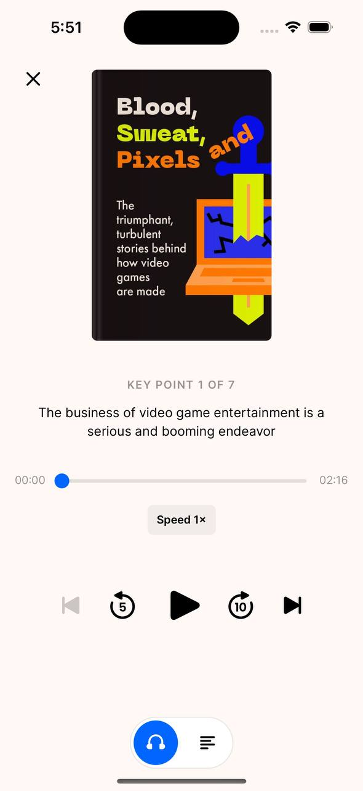

# headway-book-summary-player

Home assignment of the Headway company.

## Description

There were 2 actual audiobooks that suppose to be handled in the application:

- [Кровь, пот и пиксели. Обратная сторона индустрии видеоигр](https://rutracker.org/forum/viewtopic.php?t=5737054) in the `mp3.` format (~220Mb);
- ["The Art of Public Speaking" by Dale Breckenridge Carnegie](https://www.audiobooksworld.org/the-art-of-public-speaking) in the `.m4b` format (~600Mb);

All audio and image assets are keeping in the /Resources/Audiobooks. Find out either of book in a separate directory.

### Definition of Ready

Зробити максимально точну копію UI та функціоналу плеєру для саммарі книжок. Можна обрати одну, будь яку, книжку на вибір. Треба дати можливість перемикатись між сторінками, змінювати швидкість та прискорювати програвання аудіо. Стек: SwiftUI, Swift Concurrency та Composable. Спробуй зробити це завдання за максимально короткий термін.

Screen Mockup

## Summary

Key things you can see in the test project:

- [ ] UI has been builded with SwiftUI.
- [ ] User interface is the same as on the design.
- [ ] Swift Concurrency framework has been used.
- [ ] Composable architecture has been used.
- [ ] Application can play only the one audio file.
- [ ] Application can play the set of audio files, eg. audio book.
- [ ] Play / pause feature.
- [ ] Audio fast-forward and rewind features.
- [ ] Audio custom seeking time interval feature (slider).
- [ ] Audio pre-defined seeking time intervals feature (e.g. 5sec back or 10sec forward).
- [ ] Change to the previous / next audio feature.
- [ ] Extra\*. Bottom audio-text UI control (switcher) is toggling.
- [ ] Extra\*. Bottom audio-text switcher is switching with animation.

### Implementation Details

The technical solution described in the [tech spec](Documentation/BookSummaryPlayerTechSpec.md) document.

## MISC: Resources That Helps Me To Build The App

- [Typography. Font Specifications](https://developer.apple.com/design/human-interface-guidelines/foundations/typography)
- [Media Control Icons](https://icons8.com/icon/set/media-controls/windows)
- [SwiftUI Slider. Apple component](https://developer.apple.com/documentation/swiftui/slider)
- [How to customise the Slider in SwiftUI](https://swdevnotes.com/swift/2021/how-to-customise-the-slider-in-swiftui/)
- [Async await in Swift explained with code examples](https://www.avanderlee.com/swift/async-await/)
- [Throwing and asynchronous Swift properties](https://www.swiftbysundell.com/articles/throwing-async-properties/)
- [Working with files and folders in Swift](https://www.swiftbysundell.com/articles/working-with-files-and-folders-in-swift/)
- [Loading media data asynchronously](https://developer.apple.com/documentation/avfoundation/media_assets/loading_media_data_asynchronously)
